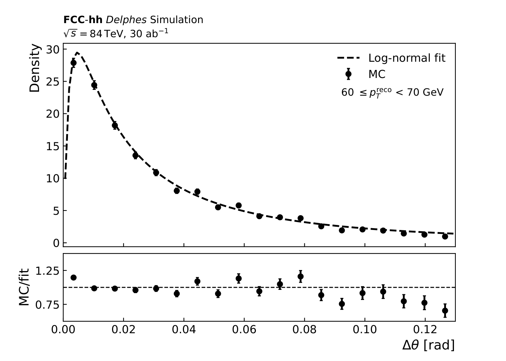

# MMC calibration

This directory contains the ingredients and workflow used to calibrate the inputs to the FCC Missing Mass Calculator (MMC) algorithm.

The calibration has two main components:

1. **Missing transverse momentum resolution - $\sigma\left(p_{\text{T}}^{\text{miss}}\right)$ calibration**
   - determination of the detector response and resolution relevant for the MMC treatment of the missing transverse momentum
   - for the purposes of a feasibility study targeting a mostly hadronic final state, only the dominant jet term is considered

2. **Input PDF calibration for the MMC**
   - construction of probability-density inputs used by the MMC scan
   - this includes the angular term, energy fraction and missing mass (for $\tau_{\text{lep}}\tau_{\text{had}}$ only)

The purpose of this directory is to provide a reproducible chain from input ntuples to final calibration products that can be used within FCCAnalyses to produce final ntuples.

---

## Getting setup
For the $\sigma\left(p_{\text{T}}^{\text{miss}}\right)$ calibration, either find the input ntuples on the Oxford data disk (`/data/atlas/users/dingleyt/FCChh/MMC/inputs`) or run the FCCAnalyses ntuple code (`analysis_HHH_4b2tau_ntuples.py`) --- this outputs the truth 

## Introduction to the Missing Mass Calculator
With $\tau$-decays including at least one neutrino (one for hadronic, two for leptonic), there is an unavoidable ambiguity in the source of genuine $p_{\text{T}}^{\text{miss}}$ in the event.
To fully reconstruct the invariant mass, the missing 3-momenta of each $\tau$ must be known - constituting 6 unknown components. 
For leptonic decays, an additional unknown of $m_{\text{miss}}$ is included - totalling 7.

### The solution
With the assumption that all $p_{\text{T}}^{\text{miss}}$ in the event arises from the neutrinos, one has 4 equations: on-shell $\tau$'s ($m_{\tau_{1/2}}$) and $p_{\text{x,y}}^{\text{miss}}$.
By scanning over missing-momentum vector azimuthal angles, $(\phi_1, \phi_2)$, the system is fully specified in the $\tau_{\text{had}}\tau_{\text{had}}$-channel. 
However, the assumption that all $p_{\text{T}}^{\text{miss}}$ arises from the neutrinos is not consistently realised. 
Often, the two $\tau$'s are back-to-back in the transverse plane and $p_{\text{T}}^{\text{miss}}$ is dominated by detector effects such as jet mismeasurement. 
Thus, an additional scan over x and y components of the $p_{\text{T}}^{\text{miss}}$ is performed according to the per-event $\sigma\left(p_{\text{T}}^{\text{miss}}\right)$. 
For each point in parameter space, the measured missing transverse momentum in the $x-y$ plane can be related to the two missing momentum components through

$$
\begin{pmatrix}
p_x^{\text{miss}} \\
p_y^{\text{miss}}
\end{pmatrix}
=
\begin{pmatrix}
\cos\phi_{\nu_1} & \cos\phi_{\nu_2} \\
\sin\phi_{\nu_1} & \sin\phi_{\nu_2}
\end{pmatrix}
\begin{pmatrix}
p_{\mathrm{T}}(\tau_1^{\text{miss}}) \\
p_{\mathrm{T}}(\tau_2^{\text{miss}})
\end{pmatrix}.
$$

Inverting this system gives the missing transverse momentum associated with each $\tau$ decay:

$$
\begin{pmatrix}
p_{\mathrm{T}}(\tau_1^{\text{miss}}) \\
p_{\mathrm{T}}(\tau_2^{\text{miss}})
\end{pmatrix}
=
\frac{1}{\sin(\phi_{\nu_2}-\phi_{\nu_1})}
\begin{pmatrix}
\sin\phi_{\nu_2} & -\cos\phi_{\nu_2} \\
-\sin\phi_{\nu_1} & \cos\phi_{\nu_1}
\end{pmatrix}
\begin{pmatrix}
p_x^{\text{miss}} \\
p_y^{\text{miss}}
\end{pmatrix}.
$$

Assuming on-shell $\tau$ leptons, and writing the $\tau$ four-momentum as the sum of visible and missing components,$
p_\tau^\mu = p_{\text{vis}}^\mu + p_{\text{miss}}^\mu,
$ one obtains after squaring,

$$
 m_{\tau}^2=
m_{\text{vis}}^2 + m_{\text{miss}}^2
+ 2E_{\text{vis}}E_{\text{miss}}
- 2\vec{p}_{\text{vis}} \cdot \vec{p}_{\text{miss}}.
$$

Expanding $\vec{p}_{\text{vis}}$ and $\vec{p}_{\text{miss}}$ in terms of their $x$, $y$, and $z$ components then leads to a quadratic equation in $p_z^{\text{miss}}$:

$$
(p_z^{\text{miss}})^2 \left[(p_z^{\text{vis}})^2 - E_{\text{vis}}^2\right]
+ p_z^{\text{miss}} \left[2A\,p_z^{\text{vis}}\right]
+ \left[A^2 - (E_{\text{vis}}p_{\mathrm{T}}^{\text{miss}})^2 - (E_{\text{vis}}m_{\text{miss}})^2\right]
= 0,
$$

where

$$
A = \frac{1}{2}\left(m_\tau^2 - m_{\text{vis}}^2 - m_{\text{miss}}^2\right)
+ \vec{p}_{\mathrm{T}}^{\text{miss}} \cdot \vec{p}_{\mathrm{T}}^{\text{vis}}.
$$

Not all real solutions of the $p_z$ quadratic are equally likely, and knowledge of the expected $\tau$-decay kinematics can be used to guide the algorithm towards the most probable visible and missing momentum configuration. The weighting of solutions and extraction of $m_{\tau\tau}$ is known as the Missing Mass Calculator algorithm and is used across the ATLAS and CDF collaborations.
The weighting function takes the form:
$$
\begin{equation*}
    -\log L = -\log \left[ \mathcal{P}\left( \theta_{3D}^{1}(p^1_{\tau}) \right) \mathcal{P}\left( \theta_{3D}^{2}(p^2_{\tau}) \right) \mathcal{P}\left( \Delta p_x^{\text{miss}} \right) \mathcal{P}\left( \Delta p_y^{\text{miss}} \right) \mathcal{P}\left( x_{\text{miss}}^1 \right)\mathcal{P}\left( x_{\text{miss}}^2 \right) \right]
\end{equation*}
$$
where $\mathcal{P}\left( \theta_{3D}^{1(2)}(p^{1(2)}_{\tau})\right)$ are the probability density functions for the angle between visible and missing components, $\mathcal{P}\left( \Delta p_{x,y}^{\text{miss}} \right)$ is a Gaussian centred around the measured $p_{\text{x,y}}^{\text{miss}}$ with width $\sigma\left(p_{\text{T}}^{\text{miss}}\right)$ and $\mathcal{P}\left( x_{\text{miss}}^1 \right)$ is a beta-function fitted to the expected missing momentum carried away per-$\tau$ decay.

# Calibrating the PDFs
## Missing transverse momenta resolution

## Angular weight
Starting with the angular term, this is fitted by a Log-Normal distribution. 
An example fit is shown below.

## Missing momentum fraction

## Mass prior

